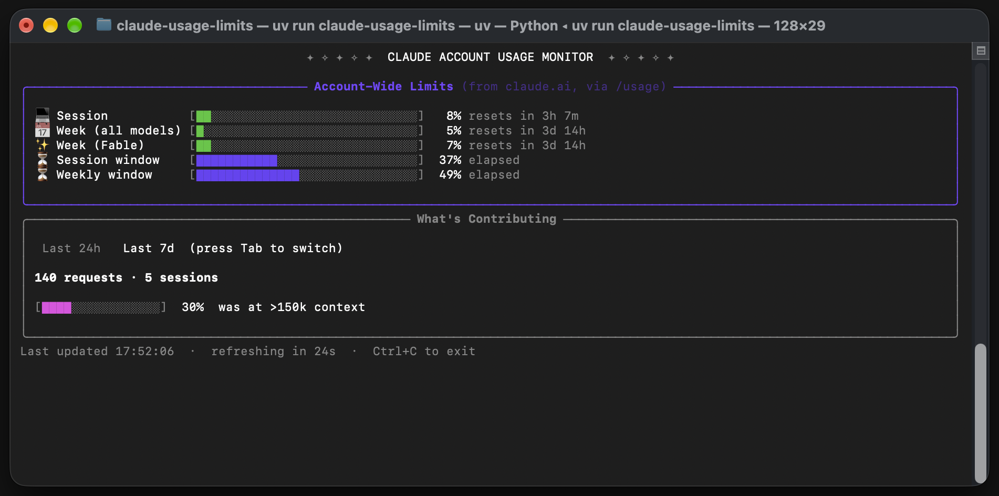
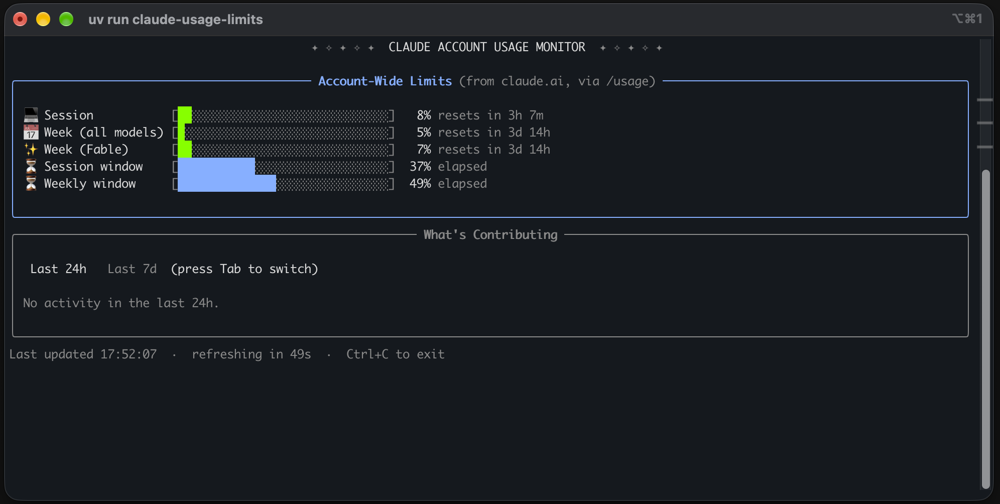

# claude-usage-limits

[](https://github.com/eduardo-veras/claude-usage-limits/actions/workflows/test.yml)
[](https://python.org)
[](LICENSE)
[](http://makeapullrequest.com)

A small terminal dashboard for your **Claude account-wide usage limits**: the
current 5-hour session, the weekly limit (all models) and the weekly per-model
limit, the same numbers you see in *Settings > Usage* or with `/usage` in
Claude Code.



Comparing a limit bar with its "window elapsed" bar tells you at a glance
whether you are burning quota faster than the clock.

## How it works

It runs `claude -p "/usage" --output-format json`, parses the text, and renders
it with [rich](https://github.com/Textualize/rich). Authentication stays
entirely inside the official Claude Code CLI: this tool never sees a token,
cookie or API key, and makes no network requests of its own.

## Requirements

- Python 3.9+
- [Claude Code](https://claude.com/claude-code) installed and logged in (`claude` on your `PATH`)
- macOS, Linux or Windows. On Windows the Tab key is not available (pick the panel's window with `--view` instead); the Windows path is covered by CI but has not been tried on a real machine yet

## Install

```bash
uv tool install git+https://github.com/eduardo-veras/claude-usage-limits
# or
pipx install git+https://github.com/eduardo-veras/claude-usage-limits
```

## Usage

```bash
claude-usage-limits                 # live dashboard, refreshes every 60s
claude-usage-limits --interval 300  # refresh every 5 minutes
claude-usage-limits --once          # print once and exit
claude-usage-limits --view 24h      # contributing panel: last 24h instead of the default 7d
claude-usage-limits --json          # parsed data as JSON, for scripts
```

The "What's Contributing" panel starts on the last 7d (`--view 24h` for the
last 24h). While it is running, **Tab** switches between the two on macOS and
Linux, and **Ctrl+C** exits.

Each refresh is one `claude -p "/usage"` call, so there is little reason to go
much below the default interval.

## Themes

Only foreground colours are set; your terminal background is never touched.

| `--theme` | For | Colours |
|-----------|-----|---------|
| `classic` | Any terminal; follows your own palette (Solarized, Dracula, ...) | 16 ANSI colours |
| `dark`    | Dark backgrounds | 256-colour, high contrast |
| `light`   | Light backgrounds | 256-colour, high contrast |
| `auto` (default) | Picks `light`/`dark` from `$COLORFGBG` when the terminal sets it, otherwise `classic` | |

`classic` in macOS Terminal is the screenshot at the top; this is `auto` picking
`dark` in iTerm2:



If emoji or block characters render badly (misaligned columns, `?` boxes, some
SSH/tmux/CI setups), use `--ascii` for plain `#`/`-` bars and `+--+` borders.
It is enabled automatically when stdout is not UTF-8. Colours are dropped
automatically when output is piped or [`NO_COLOR`](https://no-color.org) is set.

## Development

```bash
git clone https://github.com/eduardo-veras/claude-usage-limits
cd claude-usage-limits
uv run --extra test pytest        # run the tests
uv run claude-usage-limits --once # run from source
```

```
src/
  claude_usage_limits/
    cli/main.py            # argument parsing, --once / --json
    core/fetcher.py        # runs `claude -p "/usage"`
    core/parser.py         # parses its text output
    monitoring/live.py     # live refresh loop, Tab / Ctrl+C handling
    terminal/themes.py     # colour themes, glyph sets, background detection
    ui/progress_bars.py    # percentage bars
    ui/components.py       # the two panels
    ui/layouts.py          # whole dashboard
    utils/time_utils.py    # reset-time parsing
  tests/
```

The parser depends on the wording of `/usage`, which can change between Claude
Code releases. If a row shows "no data", please open an issue with the output
of `claude -p "/usage"` (redact project names if you like).

## Inspiration and comparison with Claude Code Usage Monitor

This project was inspired by [Claude Code Usage Monitor](https://github.com/Maciek-roboblog/Claude-Code-Usage-Monitor) by Maciek
(MIT). No code is shared, but the dashboard style, theme approach and
repository layout follow its lead. It answers a narrower question with a
different data source: Claude Monitor is the far more complete tool, this one
only does "how close am I to my account limits, and why?".

| | claude-usage-limits | Claude Code Usage Monitor |
|---|---|---|
| Question it answers | How much of my session / weekly limit is used, and when does it reset? | How many tokens and dollars am I burning, how fast, and when will I run out? |
| Data source | The text printed by `claude -p "/usage"` | Local Claude Code transcripts, plus official `rate_limits` captured by a statusline hook (`--statusline`) |
| Account limits shown | Session (5h), week (all models), week (per model) | Session (5h) and week, when the statusline capture is fresh; labeled local estimates otherwise |
| Needs an active Claude Code session | No, it asks on demand | Yes for official numbers (the hook only fires while Claude Code is running) |
| Setup | None beyond being logged in to `claude` | Optional hook install and plan selection (`--plan pro/max5/max20/custom`) |
| "What's contributing" breakdown | Yes, last 24h / 7d (as reported by `/usage`) | No |
| Tokens, cost, burn rate, forecasts | No | Yes, including P90-based limit detection |
| Daily / monthly history, CSV / JSON export | `--json` snapshot only | Yes (`--view daily/monthly`, local warehouse, state files) |
| Refresh cost | Spawns one `claude` process per refresh (default every 60s) | Reads local files, refreshes every few seconds |
| Robustness | Parses human-readable text, so a wording change in `/usage` can break it | Reads structured JSON |
| Dependencies | `rich` | `rich`, `numpy`, `pydantic`, `pytz`, `pyyaml`, ... |
| Platforms | macOS, Linux, Windows (no Tab key) | macOS, Linux |

Use Claude Monitor if you want token-level analytics and forecasting. Use this
if you just want the numbers from *Settings > Usage* in a terminal pane with no
setup. They run fine side by side.

This project is not affiliated with Anthropic.

## License

[MIT](LICENSE)
